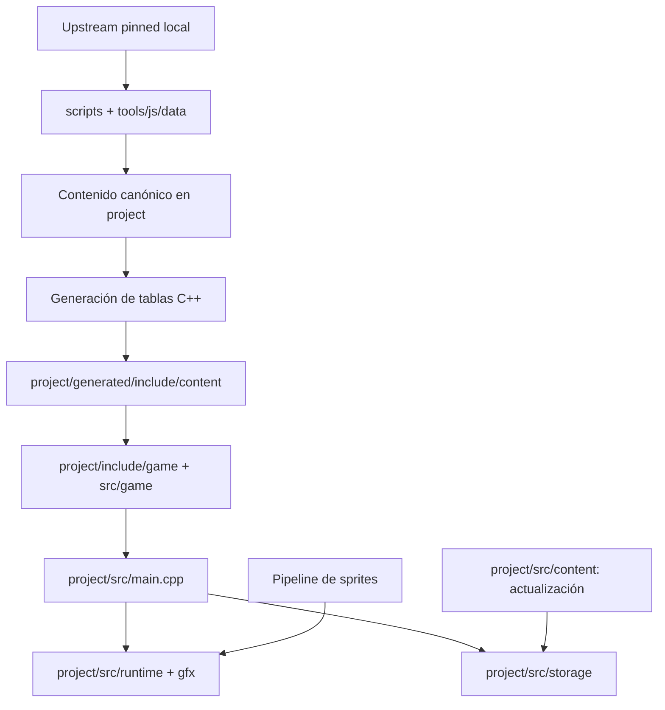

# Brain map — PokéRogue para Old 3DS

Mapa de la estructura actual. [brain-map.json](brain-map.json) contiene archivos, capas, dependencias y entradas por tarea. Regenerar con `npm run brain-map`.

## Capas

El diagrama muestra capas y responsabilidades. Los enlaces concretos `import`/`include` están en el JSON; no demuestra ejecución ni que Classic u OTA estén completos.

## Entradas mínimas por tarea

1. **Especies, movimientos y habilidades**
   1. `tools/js/data/PokerogueImporter.js`: entrada de importación real.
   2. `scripts/import_pokerogue_content.mjs`: snapshots pinned, contenido e informe.
   3. `scripts/generate_3ds_runtime_content.mjs`: adaptación a tablas C++.
   4. `test/migration_content_tests.js`: pruebas de contenido; ejecución aplazada.
2. **Combate y RNG**
   1. `project/include/game/PokemonBattleState.hpp` y `project/src/game/PokemonBattleState.cpp`.
   2. Headers de resolvers y políticas en `project/include/game/`.
   3. `test/battle_tests.js` y `test/rng_tests.js`.
3. **Presentación en doble pantalla y assets**
   1. `project/src/main.cpp`: entrada y controles.
   2. `project/src/runtime/PokemonAtlasPresenter.cpp` y `project/src/gfx/renderer2d.cpp`.
   3. `scripts/prepare_pokerogue_sprite_catalog.mjs`: catálogo de sprites/conversión.
4. **Guardado y exportación**
   1. `project/src/storage/NativeRunSave.cpp`.
   2. `project/src/storage/SdNativeSaveStorage.cpp`.
5. **Actualización de contenido**
   1. `project/src/content/ContentUpdateStore.cpp`.
   2. `docs/progress/NATIVE_RUNTIME_CONTENT_PACK_CONTRACT.md`.

## Uso sin cargar todo el repositorio

1. Seleccionar una entrada de `tasks` del JSON.
2. Seguir únicamente sus dependencias salientes (`from` → `to`); consultar referencias entrantes si se cambia un contrato.
3. Para una nueva especie, empezar por importer → contrato canónico → generador; ampliar a assets/locales solo si la tarea los afecta. No cargar renderer ni todos los catálogos.
4. Consultar pendientes en `MIGRATION_STATUS.md` y `progress/POKEROGUE_3DS_REMAINING_WORK.md`.

## Alcance y límites

1. Generación determinista: rutas y enlaces ordenados, sin timestamps.
2. Captura imports JS literales e includes C++ locales; omite dependencias externas, imports dinámicos calculados y llamadas en ejecución.
3. Incluye tooling de escenas conservado para generación/parity; no existe editor web.
4. Los perfiles de tareas son puntos de entrada, no dependencias de ejecución. No se leen los catálogos grandes para construir el mapa.
5. Tests y compilación siguen aplazados; un enlace estructural no prueba integración funcional.

## Apariencias y submenús

1. Perfil `pokemonAppearances`: materialización pinned → staging → conversión física → índice generado → `PokemonAtlasPresenter`; incluye pruebas Python/JS y harness nativo.
2. Perfil `frontendMenus`: navegación → comandos → almacenamiento en `main.cpp` → guard estático y harness nativo.
3. El mapa ayuda a localizar dependencias; no demuestra integración visual ni ejecución en hardware.
